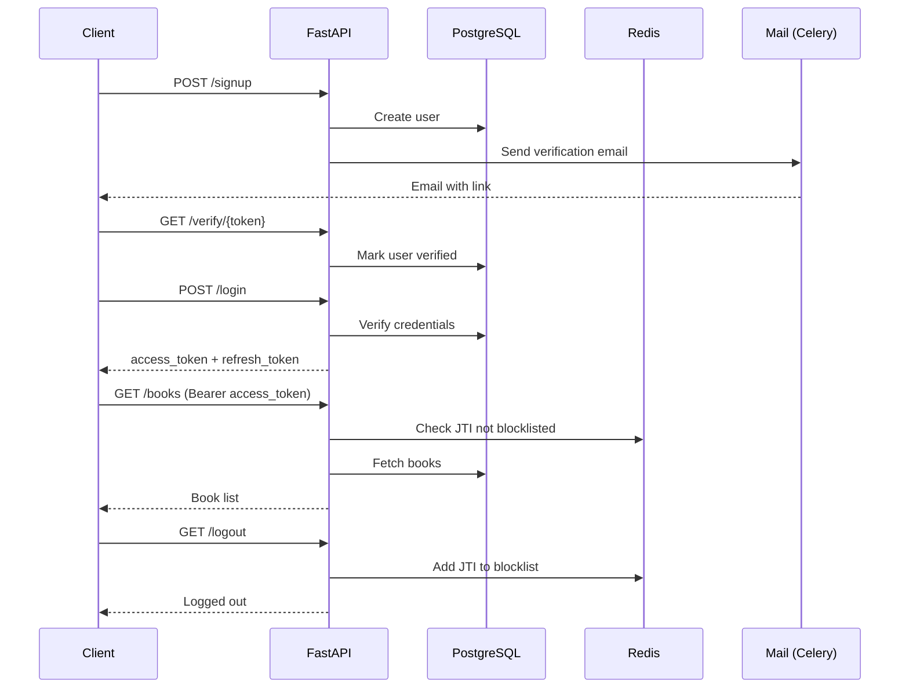

# ChapterOne

**ChapterOne** is a RESTful book review web service built with FastAPI. Users can sign up, manage books, and write reviews. Authentication uses JWT (access + refresh tokens), emails are sent asynchronously via Celery, and Redis handles token blacklisting on logout.

## Features

- User registration with email verification
- JWT-based authentication (access & refresh tokens)
- Role-based access control (`admin` / `user`)
- CRUD operations for books
- Review system for books
- Password reset via email
- Token blacklisting on logout (Redis)
- Async email delivery (Celery + FastAPI-Mail)

---

## Tech Stack

| Technology       | Purpose                         |
|------------------|---------------------------------|
| FastAPI          | Web framework                   |
| SQLModel         | ORM (built on SQLAlchemy)       |
| PostgreSQL       | Database                        |
| Redis            | Token blacklist / Celery broker |
| Celery           | Async task queue                |
| PyJWT            | JWT encoding / decoding         |
| passlib (bcrypt) | Password hashing                |
| FastAPI-Mail     | Email sending                   |
| Alembic          | Database migrations             |

---

## Project Structure

```
bookstore/
├── src/
│   ├── __init__.py          # FastAPI app, router registration
│   ├── config.py            # Pydantic settings (env vars)
│   ├── celery_tasks.py      # Celery app + async email task
│   ├── mail.py              # FastAPI-Mail configuration
│   ├── middleware.py         # CORS, trusted host, logging
│   ├── auth/                # Signup, login, logout, password reset
│   ├── books/               # Book CRUD
│   ├── reviews/             # Review creation
│   ├── db/                  # Models, engine, session, Redis client
│   └── templates/           # Email templates (empty)
├── migrations/              # Alembic migrations
├── requirements.txt
├── alembic.ini
└── .env
```

- **`src/auth/`** — Authentication routes, schemas, service, utility functions, dependency classes (token bearers, role checker).
- **`src/books/`** — Book routes, schemas, service.
- **`src/reviews/`** — Review routes, schemas, service.
- **`src/db/`** — SQLModel models (`User`, `Book`, `Review`), async engine, session generator, Redis client.

---

## Setup Instructions

### 1. Clone the repository

```bash
git clone https://github.com/HeyThereParth/fastapi-auth-project.git
cd bookstore
```

### 2. Create a virtual environment

```bash
python -m venv venv
venv\Scripts\activate    # Windows
# source venv/bin/activate  # macOS/Linux
```

### 3. Install dependencies

```bash
pip install -r requirements.txt
```

### 4. Configure environment variables

Create a `.env` file in the root (see [Environment Variables](#environment-variables) below).

### 5. Run Alembic migrations

```bash
alembic upgrade head
```

### 6. Start Redis

Make sure Redis is running locally on port `6379` (or update `REDIS_URL` in `.env`).

```bash
redis-server
```

### 7. Start Celery worker

```bash
celery -A src.celery_tasks.c_app worker --loglevel=info
```

### 8. Start FastAPI

```bash
fastapi dev src/
```

### 9. Access Swagger docs

Visit [http://localhost:8000/docs](http://localhost:8000/docs)

---

## Environment Variables

| Variable         | Description                                |
|------------------|--------------------------------------------|
| `DATABASE_URL`   | Async PostgreSQL connection string         |
| `JWT_SECRET`     | Secret key for signing JWTs                |
| `JWT_ALGORITHM`  | JWT signing algorithm (e.g. `HS256`)       |
| `REDIS_URL`      | Redis connection string (default: `redis://localhost:6379/0`) |
| `MAIL_USERNAME`  | SMTP username                              |
| `MAIL_PASSWORD`  | SMTP password or app password              |
| `MAIL_FROM`      | Sender email address                       |
| `MAIL_PORT`      | SMTP port (e.g. `587`)                     |
| `MAIL_SERVER`    | SMTP server (e.g. `smtp.gmail.com`)        |
| `MAIL_FROM_NAME` | Display name for outgoing emails           |
| `DOMAIN`         | Domain for email verification links (e.g. `localhost:8000`) |

---

## API Endpoints

### Auth

| Method | Endpoint                                   | Description                    | Auth Required |
|--------|--------------------------------------------|--------------------------------|---------------|
| POST   | `/api/v1/auth/signup`                      | Register a new user            | No            |
| GET    | `/api/v1/auth/verify/{token}`              | Verify email address           | No            |
| POST   | `/api/v1/auth/login`                       | Login, returns JWT tokens      | No            |
| GET    | `/api/v1/auth/refresh_token`               | Get a new access token         | Refresh Token |
| GET    | `/api/v1/auth/me`                          | Get current user profile       | Access Token  |
| GET    | `/api/v1/auth/logout`                      | Invalidate access token        | Access Token  |
| POST   | `/api/v1/auth/password-reset-request`      | Request password reset email   | No            |
| POST   | `/api/v1/auth/password-reset-confirm/{token}` | Reset password with token   | No            |
| POST   | `/api/v1/auth/send_mail`                   | Send custom email to addresses | No            |

### Books

| Method | Endpoint                              | Description                | Auth Required |
|--------|---------------------------------------|----------------------------|---------------|
| GET    | `/api/v1/books/`                      | List all books             | Access Token  |
| GET    | `/api/v1/books/user/{user_uid}`       | List books by a specific user | Access Token  |
| POST   | `/api/v1/books/`                      | Create a new book          | Access Token  |
| GET    | `/api/v1/books/{book_uid}`            | Get a single book (with reviews) | Access Token  |
| PATCH  | `/api/v1/books/{book_uid}`            | Update a book              | Access Token  |
| DELETE | `/api/v1/books/{book_uid}`            | Delete a book              | Access Token  |

### Reviews

| Method | Endpoint                              | Description                | Auth Required |
|--------|---------------------------------------|----------------------------|---------------|
| POST   | `/api/v1/reviews/book/{book_uid}`     | Add a review to a book     | Access Token  |

> All protected endpoints require the `Authorization: Bearer <token>` header. Users must have a verified email and be assigned either the `admin` or `user` role.

---

## Authentication Flow

### Signup & Email Verification

A new user registers via `POST /api/v1/auth/signup`. The password is hashed with bcrypt and the user is stored in the database. An email containing a signed verification link is sent asynchronously via Celery. Clicking the link calls `GET /api/v1/auth/verify/{token}`, which marks the user as verified.

### Login & Token Exchange

The user sends their email and password to `POST /api/v1/auth/login`. On success, two JWTs are returned: an **access token** (1-hour expiry) and a **refresh token** (2-day expiry). The access token is sent with every protected request. When it expires, the client can call `GET /api/v1/auth/refresh_token` with the refresh token to obtain a new access token without re-entering credentials.

### Logout

Calling `GET /api/v1/auth/logout` adds the access token's JWT ID (JTI) to a Redis blocklist. Subsequent requests using that token are rejected even if the token hasn't expired yet.

### Password Reset

A user requests a password reset via `POST /api/v1/auth/password-reset-request`. An email with a signed token link is sent. Clicking through to `POST /api/v1/auth/password-reset-confirm/{token}` with a new password updates the user's password hash.



---

## Future Improvements

- [ ] Pagination and filtering for the books listing endpoint.
- [ ] User profile update endpoints (change name, email, avatar).
- [ ] Admin dashboard endpoints (manage users, moderate reviews).
- [ ] Rate limiting to prevent brute-force attacks on login.
- [ ] OAuth2 social login (Google, GitHub).
- [ ] Book cover image upload (S3 / local storage).
- [ ] Email templates rendered from files instead of inline HTML strings.

---

## Author

**Parth** — [GitHub](https://github.com/HeyThereParth)